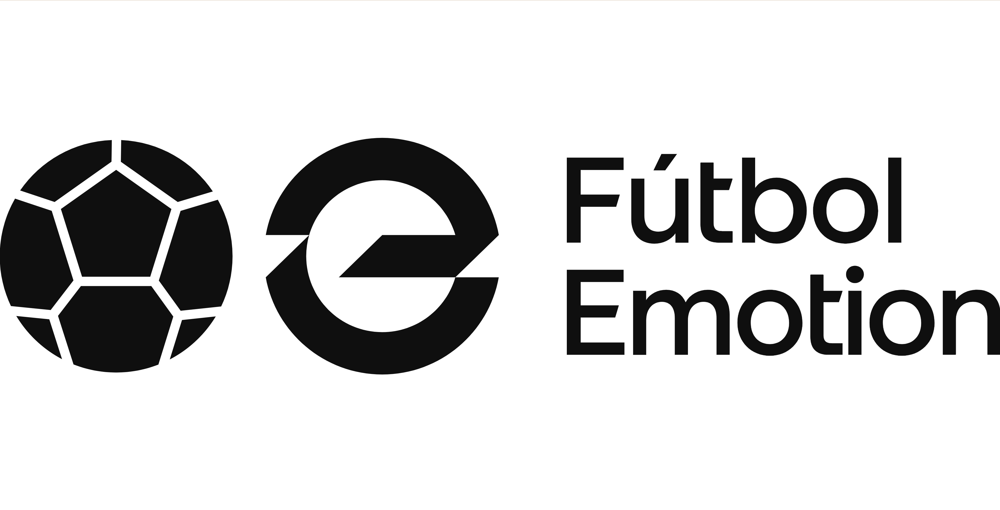

# Tienda de Fútbol Online
## Unai Fernandez Escalante 2ºDAW

## Descripción
OnlyFut es una página web de venta de material de fútbol para aficionados y profesionales. Ofrecemos una amplia variedad de productos de alta calidad.

## Productos

* Balones de fútbol
* Equipaciones de fútbol
* Botas de fútbol
* Guantes de portero
* Accesorios de fútbol

## Características de la tienda

* Fácil navegación y búsqueda de productos
* Descripciones detalladas de cada producto
* Imágenes de alta calidad de cada producto
* Sistema de pago seguro
* Envío rápido y eficiente

## Tecnologías utilizadas

* Front-end: HTML, CSS, JavaScript
* Back-end: PHP, MySQL
* Framework: Bootstrap

## Enlace de ejemplo
[Visita la tienda de fútbol online](https://www.futbolemotion.com/)

## Imagen de ejemplo


## Tabla de productos
| Producto | Precio | Descripción |
| --- | --- | --- |
| Balón de fútbol | 50€ | Balón adidas Oficial Eurocopa 2024 |
| Equipación de fútbol | 120€ | Equipación Adidas Real Madrid |
| Botas de fútbol | 279€ | Bota adidas Predator Elite |
| Botas de fútbol | 250€ | Bota Nike Air Zoom Mercurial Superfly 10 Elite |
| Botas de fútbol | 150€ | Bota Skechers SKX_01 High Diamond |
| Guantes de portero | 140€ | Guantes adidas Predator Pro Hybrid |
| Espinilleras de fútbol | 50€ | Espinillera Nike Mercurial Flylite Superlock |

## Código de ejemplo
```php
// Ejemplo de código PHP para mostrar productos
$botas = array(
  array('nombre' => 'Bota adidas Predator Elite', 'precio' => 279),
  array('nombre' => 'Bota Nike Air Zoom Mercurial Superfly 10 Elite', 'precio' => 250),
  array('nombre' => 'Bota Skechers SKX_01 High Diamond', 'precio' => 150)
);

foreach ($botas as $bota) {
  echo '<h2>' . $bota['nombre'] . '</h2>';
  echo '<p>Precio: ' . $bota['precio'] . '€</p>';
}